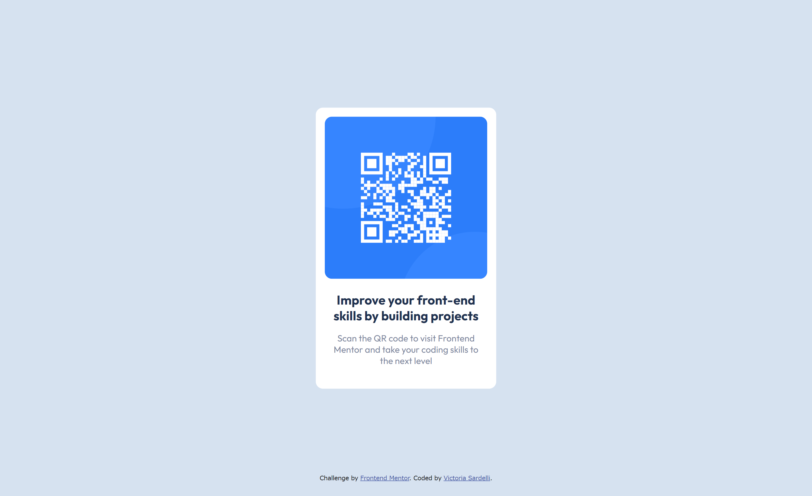

# Frontend Mentor - QR code component solution

This is a solution to the [QR code component challenge on Frontend Mentor](https://www.frontendmentor.io/challenges/qr-code-component-iux_sIO_H). Frontend Mentor challenges help you improve your coding skills by building realistic projects. 

## Table of contents

- [Overview](#overview)
  - [Screenshot](#screenshot)
  - [Links](#links)
- [My process](#my-process)
  - [Built with](#built-with)
  - [What I learned](#what-i-learned)
  - [Continued development](#continued-development)
  - [Useful resources](#useful-resources)
- [Author](#author)

## Overview

### Screenshot

### Links

- Solution URL: (https://github.com/Victoria-Sardelli/qr-code)
- Live Site URL: (https://victoria-sardelli.github.io/qr-code/)

## My process

### Built with

- Semantic HTML5 markup
- CSS
- Flexbox

### What I learned

This was a great exercise for me to start applying the basics of HTML and CSS that I had been reading about. It got me thinking about various ways to accomplish goals that, although appearing simple, proved to be more challenging than I had expected.
I learned more about the flexbox layout, as well as strategies for sizing and arranging elements on the page. I also learned more about using fonts and media queries. 

### Continued development

I want to get more comfortable using flexbox and other layouts, as well as learn more best practices for HTML and CSS overall. I would also like to keep training my eye to recognize visual details like spacing and size.

### Useful resources

- (https://blog.devgenius.io/a-bite-sized-best-practices-guide-for-css-units-em-rem-px-and-more-f621c0d56df4) - This helped me better understand the differences between using px, em, and rem!

## Author

- Frontend Mentor - [@Victoria-Sardelli](https://www.frontendmentor.io/profile/Victoria-Sardelli)